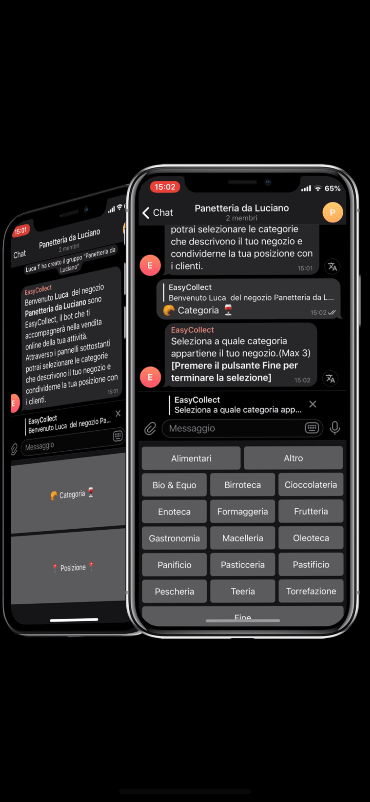
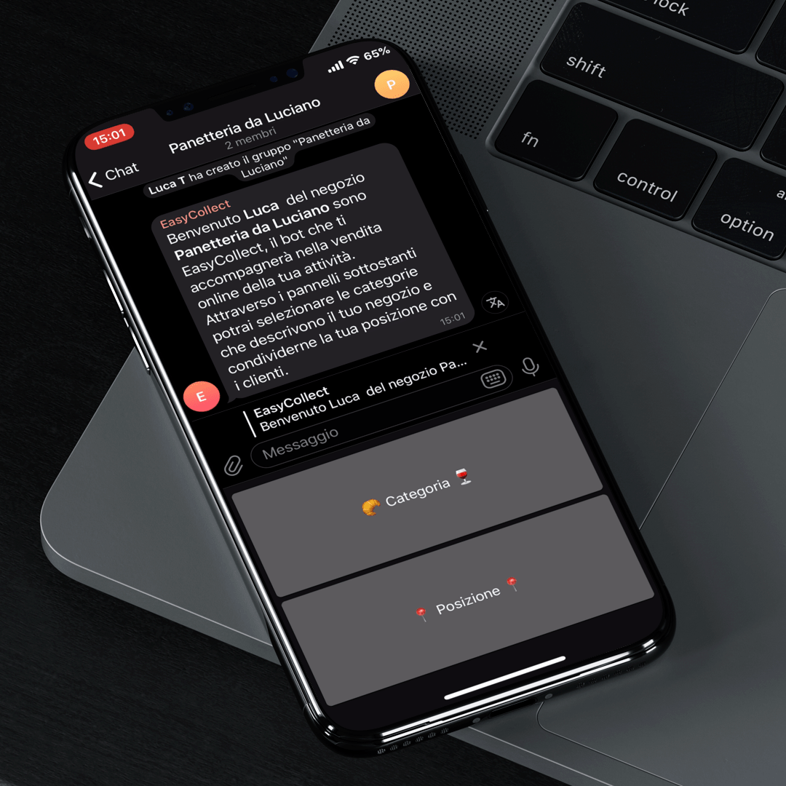

# EasyCollectTelegramBot

## Screenshots

<div align="center">
	 
	 
	 
</div>

### Checkout the [Youtube Video](https://www.youtube.com/watch?v=_EMnVut2w3c&feature=youtu.be)

## Installazione

```shell
	cd Bot
	pip install -r requirements.txt
	python bot.py
```


## Commerciante

- Crea un gruppo e aggiunge il bot come amministratore
- Riferisce al bot che categorie di negozio ha, massimo tre scelte
- Riferisce al bot dove si trova il negozio
- A questo punto la registrazione del suo negozio è completata con successo
- Salvataggio credenziali utente su file

