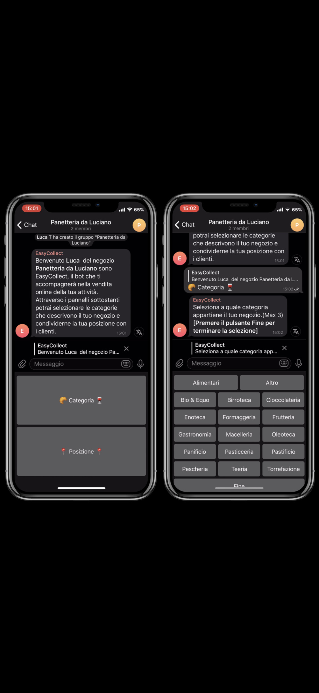

# EasyCollectTelegramBot

## Screenshots

Main Window | Keyboards
:-------------------------:|:-------------------------:
 | 

   

## Installazione

```shell
	cd Bot
	pip install -r requirements.txt
	python bot.py
```


## Commerciante

- Crea un gruppo e aggiunge il bot come amministratore
- Il commerciante riferisce al bot che categorie di negozio ha, massimo tre scelte
- Il commerciante riferisce al bot dove si trova il negozio
- Salvataggio credenziali utente su file

